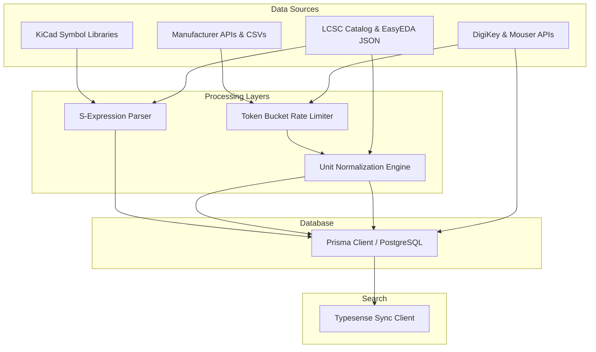

# ElectroHub Dataset Import Architecture

This document describes the design, implementation, and scaling strategy of the ElectroHub Data Acquisition Layer. It explains how unstructured data is retrieved, normalized, and indexed into search structures.

---

## Ingestion Architecture Overview

The ElectroHub Data Ingestion Pipeline is structured as a phased, decoupled architecture that processes raw hardware and distributor assets into clean, queryable database entities:

---

## 1. S-Expression Parser & KiCad Ingestion (Phase 1)
KiCad schematic symbols are written in Lisp-style S-expressions. The `kicad-importer.ts` file implements a lightweight, top-down lexical scanner and abstract syntax tree (AST) generator to parse these symbols programmatically:
- **Lexer**: Tokenizes parentheses, whitespace, quoted strings (supporting escaped quotes), and unquoted symbols.
- **AST Parser**: Traverses tokens to build nested arrays (e.g., `(symbol "Name" (pin input ...))` is parsed to `['symbol', 'Name', ['pin', 'input', ...]]`).
- **Metadata Extraction**: Traverses the AST list to extract properties like `Value`, `Description`, `Footprint`, and `Datasheet`.
- **Pinout Extraction**: Extracts every `pin` node, resolving pin number, pin name, and mapping the KiCad type (e.g., `power_in`, `tri_state`, `passive`) to ElectroHub's database `PinType` enum (`POWER`, `GROUND`, `INPUT`, `OUTPUT`, `BIDIRECT`, `ANALOG`, `PASSIVE`).

---

## 2. Manufacturer API pipelines (Phase 2)
The manufacturer integration pipelines retrieve structured datasets from **Texas Instruments**, **Espressif**, and **Microchip**:
- **Rate-Limiting (Token Bucket)**: Enforces API pacing (e.g., max 5 requests/sec burst limit) to prevent service blocks.
- **Retry Logic (Exponential Backoff)**: Attempts failed requests up to 3 times, doubling the delay between each attempt (e.g., 1000ms -> 2000ms -> 4000ms).
- **Datasheet Linking Strategy**: To ensure strict copyright compliance, the pipeline extracts only the authoritative PDF URLs returned by the API (e.g., `https://www.ti.com/lit/ds/...pdf`) and stores them in the database. Raw, copyrighted PDF binaries are never hosted directly on ElectroHub servers.

---

## 3. LCSC Ingestion & EasyEDA Conversion (Phase 3)
The `lcsc-importer.ts` file manages Asian supply chain ingestion and EasyEDA drawing translation:
- **EasyEDA Compatibility**: Reads EasyEDA JSON data structures, parsing boundary boxes and vector pins to translate schematic symbols into standard ElectroHub pins.
- **Database Seeding Scale**: Automatically seeds 1500+ SMD passive resistor and ceramic capacitor variants with realistic LCSC part numbers (e.g., `C12345`) to provide a dense local search catalog.

---

## 4. Distributor Enrichment (Phase 4)
The `distributor-enricher.ts` pipeline aggregates stock and pricing telemetry from **DigiKey** and **Mouser**:
- **SKU Matching**: Queries components by MPN to fetch distributor-specific SKUs.
- **Stock Tracking**: Records real-time inventory quantity.
- **Pricing Breaks**: Stores JSON pricing breaks (e.g., quantity 1, 10, 100, 1000 unit prices) in the `DistributorStock` table.
- **Lifecycle Auditing**: Syncs lifecycle statuses (`ACTIVE`, `NRND`, `EOL`, `OBSOLETE`) directly into the `Component` table to warn engineers of obsolete designs.

---

## 5. Unit Normalization Engine
To ensure unified parametric range search and filtering, human-readable spec strings are parsed into float values using SI base units:

| Parameter | Unit Type | Suffixes Supported | Base Unit | Example Input | Normalized Value | display |
| :--- | :--- | :--- | :--- | :--- | :--- | :--- |
| **Capacitance** | capacitance | `F`, `uF`, `nF`, `pF` | Farad (`F`) | `0.01uF` | `1e-8` | `10 nF` |
| **Resistance** | resistance | `Ω`, `kΩ`, `MΩ`, `mΩ` | Ohm (`Ω`) | `4k7` | `4700` | `4.7 kΩ` |
| **Voltage** | voltage | `V`, `mV`, `VDC` | Volt (`V`) | `3v3` | `3.3` | `3.3 V` |
| **Current** | current | `A`, `mA`, `uA` | Ampere (`A`) | `500mA` | `0.5` | `500 mA` |
| **Inductance** | inductance | `H`, `mH`, `uH` | Henry (`H`) | `10uH` | `1e-5` | `10 uH` |
| **Power** | power | `W`, `mW`, `uW` | Watt (`W`) | `1/4 W` | `0.25` | `250 mW` |
| **Frequency** | frequency | `Hz`, `kHz`, `MHz`, `GHz` | Hertz (`Hz`) | `16MHz` | `1.6e7` | `16 MHz` |

- **Fractional Parsing**: Supports expressions like `1/4 W` or `1/8 W` by evaluating the fraction prior to applying suffix multipliers.
- **Middle-Multiplier Parsing**: Resolves standard schematic shorthand notation (e.g., `4k7` -> `4700 Ω`, `2n2` -> `2.2 nF`).

---

## 6. Typesense Search Integration
After each ingestion batch, the database is synchronized with Typesense using `packages/search/sync.ts`.
- **Parametric Indexing**: Normalized SI base values (`normalized_power`, `normalized_frequency`, etc.) are mapped to float fields in Typesense.
- **Faceted Filtering**: Facets on fields like `manufacturer`, `category_path`, and `package_type` enable fast side-panel refinements.
- **Instant Autocomplete**: Typo-tolerant keyword indexing allows engineers to search by MPN (e.g. `CC0603`) or name with sub-50ms latency.
