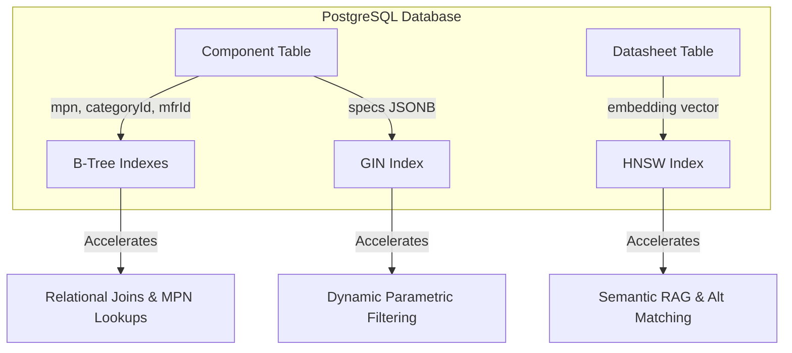

# ElectroHub Database Indexing Strategy

To achieve sub-10ms query latency and support advanced search patterns (parametric filtering, real-time stock verification, and semantic AI recommendations), ElectroHub employs a multi-tiered indexing strategy in PostgreSQL. This document details the indexes, their SQL creation statements, and engineering justifications.

---

## 1. Indexing Architecture Overview

The database layer utilizes three distinct types of indexes:
1. **B-Tree Indexes**: Standard relational indexes for exact matches, range queries, sorting, and foreign key joins.
2. **GIN (Generalized Inverted) Indexes**: Document-store indexes designed to accelerate parametric queries on highly variable, unstructured JSONB columns.
3. **HNSW (Hierarchical Navigable Small World) Indexes**: Vector-optimized indexes for high-speed, approximate nearest neighbor (ANN) semantic search and alternative component matching.



---

## 2. B-Tree Indexes (Relational & Core Keys)

B-Tree indexes are the default index type in PostgreSQL. They are highly efficient for sorting, range queries (`<`, `<=`, `=`, `>=`, `>`), and exact matches.

### SQL Statements

```sql
-- Unique Index for Manufacturer Part Numbers (MPN)
-- Essential for direct search-by-part-number and slug resolution
CREATE UNIQUE INDEX IF NOT EXISTS idx_components_mpn 
ON "Component"("mpn");

-- Foreign Key Indexes to optimize JOINs between Components, Manufacturers, and Categories
CREATE INDEX IF NOT EXISTS idx_components_manufacturer_id 
ON "Component"("manufacturerId");

CREATE INDEX IF NOT EXISTS idx_components_category_id 
ON "Component"("categoryId");

-- Index on Category Path for hierarchical prefix/sub-tree matching (e.g., path LIKE 'passives.capacitors.%')
CREATE INDEX IF NOT EXISTS idx_categories_path 
ON "Category"("path");

-- Optimize pin lookups and pinout rendering for components
CREATE INDEX IF NOT EXISTS idx_pins_component_id 
ON "Pin"("componentId");

-- Optimize CAD asset loading on the component detail page
CREATE INDEX IF NOT EXISTS idx_cad_assets_component_id 
ON "CadAsset"("componentId");

-- Optimize real-time distributor stock and pricing lookup
CREATE INDEX IF NOT EXISTS idx_distributor_stock_component_id 
ON "DistributorStock"("componentId");

-- Optimize workspace and BOM queries
CREATE INDEX IF NOT EXISTS idx_projects_user_id 
ON "Project"("userId");

CREATE INDEX IF NOT EXISTS idx_project_components_project_id 
ON "ProjectComponent"("projectId");

CREATE INDEX IF NOT EXISTS idx_project_components_component_id 
ON "ProjectComponent"("componentId");

CREATE INDEX IF NOT EXISTS idx_boms_project_id 
ON "BOM"("projectId");

-- Optimize User favorites lookup
CREATE INDEX IF NOT EXISTS idx_favorites_user_id 
ON "Favorite"("userId");

-- NextAuth session and account lookup optimizations
CREATE INDEX IF NOT EXISTS idx_accounts_user_id 
ON "Account"("userId");

CREATE INDEX IF NOT EXISTS idx_sessions_user_id 
ON "Session"("userId");

-- AI Chat history optimizations
CREATE INDEX IF NOT EXISTS idx_ai_conversations_user_id 
ON "AIConversation"("userId");

CREATE INDEX IF NOT EXISTS idx_ai_messages_conversation_id 
ON "AIMessage"("conversationId");
```

### Performance Justification

- **Direct Lookups**: The `idx_components_mpn` index ensures that looking up a component by its exact MPN (the most common entry point for engineers) is an $O(\log N)$ operation, completing in $<1\text{ms}$.
- **Join Optimization**: Without explicit indexes on foreign keys (`manufacturerId`, `categoryId`, `componentId`), PostgreSQL is forced to perform a sequential scan of the child table for every join. In a database of 50,000+ components, this would cause queries to degrade from milliseconds to seconds.
- **Hierarchical Path Matching**: The `idx_categories_path` index enables rapid sub-category retrieval. When a user selects a parent category like "Passives", we can instantly fetch all components in "Passives", "Passives -> Capacitors", and "Passives -> Resistors" using prefix matching.

---

## 3. GIN (Generalized Inverted Index) on JSONB (Parametric Filtering)

Electronic components are characterized by highly sparse, variable attributes. A resistor has resistance, tolerance, and power rating; an LDO regulator has input voltage range, output voltage, dropout voltage, and output current. Storing these in a `specs` JSONB column avoids sparse-column table bloat. To query this column efficiently, we use a GIN index.

### SQL Statements

```sql
-- Generalized Inverted Index on the entire specs JSONB column
CREATE INDEX IF NOT EXISTS idx_components_specs_gin 
ON "Component" USING gin (specs);
```

For highly frequent, specific queries, we can also use a jsonb path index:
```sql
-- Alternative/Additional path-specific index for JSONB path queries
CREATE INDEX IF NOT EXISTS idx_components_specs_path_gin 
ON "Component" USING gin (specs jsonb_path_ops);
```

### Performance Justification

A standard B-Tree index cannot index the keys and values inside a JSON document. If a user filters for components where `specs ->> 'voltage_max'` is `5.0` or `specs` contains `{"package": "SOT-23"}`, PostgreSQL would have to deserialize and scan every row in the `Component` table.

- **How GIN Works**: A GIN index is an "inverted index" that maps keys and values within the JSONB document to the rows containing them. 
- **Query Execution**: When running a query like:
  ```sql
  SELECT * FROM "Component" WHERE specs @> '{"package": "SOT-23", "channels": 2}';
  ```
  The GIN index resolves the exact matching rows instantly.
- **`jsonb_ops` vs `jsonb_path_ops`**: 
  - `jsonb_ops` (default) indexes every key, value, and sub-document. It supports arbitrary queries, including checking if a key exists (`specs ? 'voltage'`).
  - `jsonb_path_ops` is smaller and faster but only supports containment queries (`@>`). We implement `jsonb_ops` to support both existence checks and containment queries.

---

## 4. HNSW (Hierarchical Navigable Small World) Index (Semantic RAG & Alt Matching)

To support semantic natural language searches (e.g., *"ultra-low power 3.3V voltage regulator"*) and to calculate alternative, drop-in replacement components, we store 384-dimensional vector embeddings of the extracted datasheet texts. We utilize the `pgvector` extension with an HNSW index.

### SQL Statements

```sql
-- Ensure the pgvector extension is enabled in the database
CREATE EXTENSION IF NOT EXISTS vector;

-- Create an HNSW index on the datasheet embedding column
-- Optimized for Cosine Distance calculations (<=> operator)
CREATE INDEX IF NOT EXISTS idx_datasheet_embedding_hnsw 
ON "Datasheet" USING hnsw (embedding vector_cosine_ops)
WITH (m = 16, ef_construction = 64);
```

### Performance Justification

Calculating exact nearest neighbors (using flat indexing) requires comparing the query vector against every single vector in the database ($O(N)$ complexity). For 50,000+ components, this causes significant CPU load and high latency.

- **Why HNSW?**: HNSW is a state-of-the-art Approximate Nearest Neighbor (ANN) search algorithm. It constructs a multi-layered graph where the upper layers have long-range links (for fast routing) and the lower layers have short-range links (for fine-grained local search).
- **Complexity**: HNSW reduces search complexity to $O(\log N)$, enabling vector similarity searches to complete in $<5\text{ms}$ even on massive datasets.
- **Parameters**:
  - `vector_cosine_ops`: Used because cosine distance is the standard metric for text embedding similarity, normalizing for text length.
  - `m = 16`: Defines the maximum number of bidirectional connection links per node in the graph. `16` is the recommended default for text embeddings, balancing accuracy and memory consumption.
  - `ef_construction = 64`: Controls the size of the dynamic candidate list evaluated during index construction. A value of `64` ensures high-quality graph construction without excessively long migration times.
- **Recall Rate**: HNSW provides $>98\%$ recall accuracy compared to exact search, making it far superior to IVFFlat, which suffers from accuracy degradation unless frequently re-trained and re-indexed.

---

## 5. Maintenance & Performance Tuning

To keep indexes performing optimally:
1. **Autovacuum**: Ensure autovacuum is aggressive enough on the `Component` and `Datasheet` tables, as frequent updates to stock and specs can cause index bloat.
2. **Reindexing**: Schedule a weekly cron job to run `REINDEX TABLE CONCURRENTLY` on high-write tables (e.g., `DistributorStock`) to defragment B-Tree indexes.
3. **Query Planning**: Use `EXPLAIN ANALYZE` on search queries to ensure that the PostgreSQL Query Planner is utilizing the GIN and HNSW indexes rather than falling back to sequential scans.
