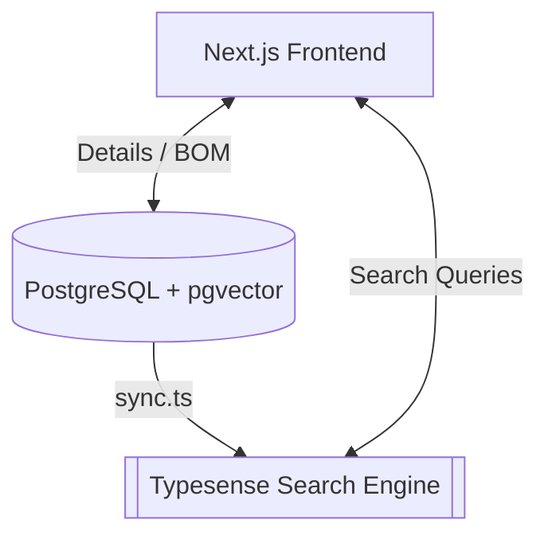

# ElectroHub Search Infrastructure & Unit Normalization Engine

This package implements the search layer and unit normalization engine for **ElectroHub**. It contains the Typesense schema, the Unit Normalization Engine, and the PostgreSQL-to-Typesense synchronization script.

---

## 1. Search Architecture Overview

ElectroHub uses **Typesense** as its primary search database. Typesense is a C++, memory-first search engine designed for sub-50ms query latencies, instant search-as-you-type, and typo tolerance.

### Architectural Blueprint


By offloading search and parametric filtering to Typesense, we achieve:
* **Instant Autocomplete**: Typo-tolerant search on Manufacturer Part Numbers (MPNs) and descriptions.
* **Faceted Filtering**: Facets on manufacturer, category, package type, lifecycle, and CAD asset presence.
* **Unified Range Filtering**: Numerical range queries on normalized electrical specifications (resistance, capacitance, voltage, etc.).
* **Zero Database Overhead**: Standard search queries bypass the relational database, preserving connection pools for transactional workloads.

---

## 2. Unit Normalization Engine

A major friction point in existing distributor websites (e.g., Mouser) is **unit fragmentation**, where values like `0.01uF`, `10nF`, and `10000pF` are treated as separate text filters. 

ElectroHub solves this by parsing arbitrary engineering value strings into:
1. **Standardized Numeric Values**: Float values in base SI units (Farads, Ohms, Volts, Amperes, Henrys).
2. **Standardized Display Strings**: Structured strings matching standard engineering shorthand (e.g., `10 nF`, `4.7 kΩ`, `3.3 V`).

The normalization engine is implemented in `normalization.ts` and supports two main notations:

### A. Standard Suffix Notation
Parses `<number> <prefix> <unit>` where spaces are optional.
* `10nF` $\rightarrow$ `1e-8 F` (`10 nF`)
* `0.01uF` $\rightarrow$ `1e-8 F` (`10 nF`)
* `10000pF` $\rightarrow$ `1e-8 F` (`10 nF`)
* `100 milliohm` $\rightarrow$ `0.1 Ω` (`100 mΩ`)
* `12 VDC` $\rightarrow$ `12 V` (`12 V`)
* `500mA` $\rightarrow$ `0.5 A` (`500 mA`)

### B. Middle-Multiplier Notation (BS 1852)
In electronics, decimal points are often replaced by the multiplier prefix to prevent them from being worn off on physical components or misread in schematics.
* `4k7` $\rightarrow$ `4.7 kΩ` (`4.7 kΩ`)
* `0R1` / `R22` $\rightarrow$ `0.1 Ω` / `0.22 Ω` (`100 mΩ` / `220 mΩ`)
* `2n2` $\rightarrow$ `2.2 nF` (`2.2 nF`)
* `4u7` $\rightarrow$ `4.7 uH` or `4.7 uF` (based on unit type)
* `3v3` $\rightarrow$ `3.3 V` (`3.3 V`)
* `1a5` $\rightarrow$ `1.5 A` (`1.5 A`)

### Standardized Display Formatting Rules
To align with standard engineering conventions, values are formatted back to strings using the most appropriate prefix:
* **Capacitance**: Expressed in `pF` (< 1nF), `nF` (< 1uF), `uF` (< 1F), and `F` ($\ge$ 1F). MilliFarads (`mF`) are bypassed as they are rarely used in catalogs.
* **Resistance**: Expressed in `mΩ` (< 1Ω), `Ω` (< 1kΩ), `kΩ` (< 1MΩ), and `MΩ` ($\ge$ 1MΩ).
* **Voltage**: Expressed in `mV` (< 1V) and `V` ($\ge$ 1V).
* **Current**: Expressed in `nA` (< 1uA), `uA` (< 1mA), `mA` (< 1A), and `A` ($\ge$ 1A).
* **Inductance**: Expressed in `nH` (< 1uH), `uH` (< 1mH), `mH` (< 1H), and `H` ($\ge$ 1H).

---

## 3. Typesense Schema (`schema.json`)

The schema defines the `components` collection. It indexes text fields, marks facet fields, and sets up float fields for range queries.

```json
{
  "name": "components",
  "fields": [
    { "name": "id", "type": "string" },
    { "name": "mpn", "type": "string", "facet": false },
    { "name": "description", "type": "string", "index": true },
    { "name": "manufacturer", "type": "string", "facet": true },
    { "name": "category", "type": "string", "facet": true },
    { "name": "category_path", "type": "string[]", "facet": true },
    { "name": "lifecycle", "type": "string", "facet": true },
    { "name": "stock_total", "type": "int32", "facet": false },
    { "name": "min_price", "type": "float", "facet": false },
    
    { "name": "normalized_voltage", "type": "float", "optional": true, "facet": false },
    { "name": "normalized_capacitance", "type": "float", "optional": true, "facet": false },
    { "name": "normalized_resistance", "type": "float", "optional": true, "facet": false },
    { "name": "normalized_current", "type": "float", "optional": true, "facet": false },
    { "name": "normalized_inductance", "type": "float", "optional": true, "facet": false },
    
    { "name": "voltage_display", "type": "string", "optional": true, "facet": false },
    { "name": "capacitance_display", "type": "string", "optional": true, "facet": false },
    { "name": "resistance_display", "type": "string", "optional": true, "facet": false },
    { "name": "current_display", "type": "string", "optional": true, "facet": false },
    { "name": "inductance_display", "type": "string", "optional": true, "facet": false },
    
    { "name": "package_type", "type": "string", "optional": true, "facet": true },
    { "name": "has_cad_assets", "type": "bool", "facet": true },
    { "name": "created_at", "type": "int64", "optional": true }
  ],
  "default_sorting_field": "stock_total",
  "symbols_to_index": ["-", "/"]
}
```

### Key Configurations:
* `category_path`: Stored as a `string[]` to support hierarchical multi-level faceting (e.g., filtering for `passives` also returns sub-categories like `capacitors` and `ceramic`).
* `symbols_to_index`: We include `-` and `/` so that MPNs like `ESP32-S3` or `MAX232/D` are indexed as cohesive terms rather than being split into separate words.
* `default_sorting_field`: Set to `stock_total` so that when users browse without a query, the most available components are displayed first.

---

## 4. Ingestion & Synchronization (`sync.ts`)

The synchronization script extracts components from the PostgreSQL database, applies the unit normalization engine, and indexes them into Typesense.

### Synchronization Workflow:
1. **Index Check / Creation**: Checks if the `components` collection exists in Typesense. If not, it reads `schema.json` and creates it. Passing the `--recreate` (or `-r`) flag will force-delete and recreate the collection.
2. **Batch Retrieval**: Queries the PostgreSQL database using Prisma Client. Components are fetched in batches of 500 (using `skip`/`take`) to prevent memory exhaustion on large datasets.
3. **Spec Extraction**: The `specs` JSONB column in PostgreSQL contains highly variable key-value pairs (extracted from datasheets). The script uses a case-insensitive alias matching list to find the correct raw strings (e.g. matching `operating_voltage`, `voltage_rating`, etc., for Voltage).
4. **Parameter Normalization**: Passes the raw strings into the `normalizeValue` engine.
5. **Stock & Pricing Aggregation**: 
   * Sums the inventory levels (`stockQty`) across all linked distributors to compute `stock_total`.
   * Evaluates the `priceTiers` JSON arrays to find the minimum unit price (typically quantity 1 price) across all distributors to compute `min_price`.
6. **Typesense Import**: Upserts the processed batch of documents into Typesense.

---

## 5. Query Strategies

To query the Typesense index from the Next.js API route, use the following strategies:

### A. Autocomplete & Fuzzy Matching
When searching for a component, we want to match both the part number and the description:
```typescript
const searchResults = await typesenseClient.collections('components').documents().search({
  q: queryText,
  query_by: 'mpn,description,manufacturer',
  sort_by: '_text_match:desc,stock_total:desc',
  num_typos: 2,
  min_len_to_verify_typo: 3,
  prefix: true, // Allows matching prefix for autocomplete
});
```

### B. Faceted Filtering
To render the sidebar filters and filter results:
```typescript
const searchResults = await typesenseClient.collections('components').documents().search({
  q: queryText,
  query_by: 'mpn,description',
  facet_by: 'manufacturer,category,lifecycle,package_type,has_cad_assets',
  filter_by: 'lifecycle:=[ACTIVE, NRND] && has_cad_assets:=true',
});
```

### C. Parametric Range Filtering
To filter by electrical values (e.g., Resistors between $1\,\text{k}\Omega$ and $10\,\text{k}\Omega$):
```typescript
const searchResults = await typesenseClient.collections('components').documents().search({
  q: '*',
  filter_by: 'category:=Resistors && normalized_resistance:[1000..10000]',
});
```

---

## 6. How to Run & Test

### Installing Dependencies
Make sure you are in the search package directory or have installed dependencies in your monorepo:
```bash
npm install
```

### Running Unit Tests
Execute the Vitest suite to verify the Unit Normalization Engine:
```bash
npm run test
```

### Triggering Database Synchronization
To sync components from PostgreSQL to Typesense:
```bash
# Run standard incremental synchronization
npm run sync

# Recreate the Typesense index and sync all components from scratch
npx ts-node sync.ts --recreate
```
